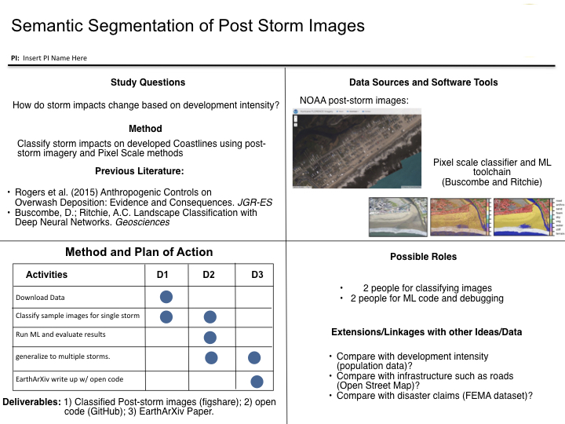

* **What's CoPe COMET?**
  + A Science Sprint to do rapid, data-driven 'Coastlines and People' science. A cohort of of researchers will assemble to transform  ideas into open scientific products within 72 hrs.   
 

* **What are the goals?**
  1. Developing collaborative networks of researchers working at the intersection of Coastlines and People
  2. Creating open science and open knowledge from openly available datasets, processed quickly using open code with open deliverables for researchers and stakeholders along the coast
  3. Testing sprint events as a means to produce data-driven CoPe research. 
  4. Crowd-sourcing a collection of publicly available data for future use by CoPe researchers and stakeholders  
 

* **What is the Basic Event structure?**
  
 

* **What does the Quad Chart / 'Project Pitch' look like?**
  

