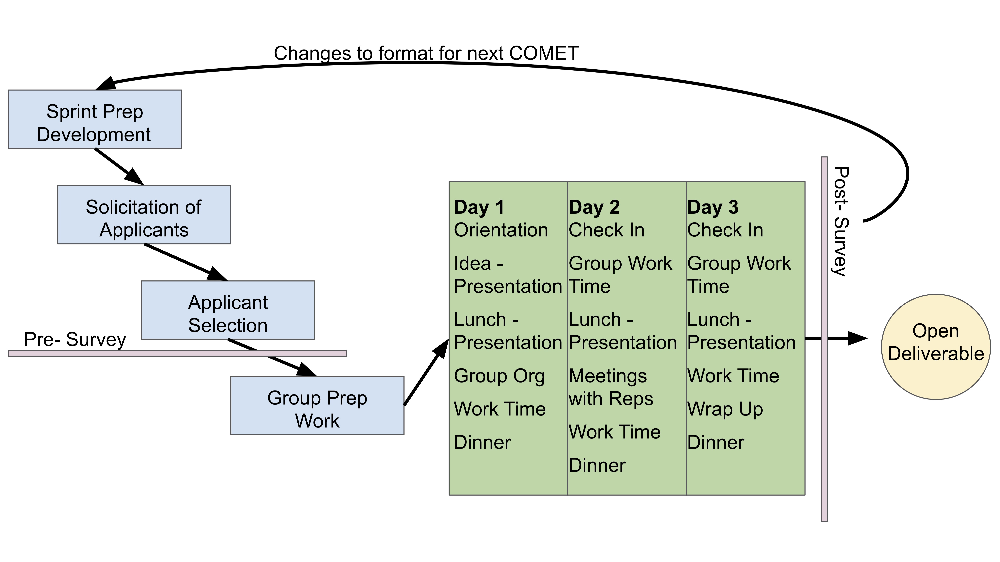

**What's CoPe COMET?**

An incubator approach for rapid, data-driven 'Coastlines and People' science created by networks of researchers. The idea is modeled on other science ‘sprints’, where teams of researchers will assemble to transform an idea into open scientific product within a short, fixed time window (72hrs). 

**What are the goals?**

1) Forming collaborative networks of researchers working at the intersection of Coastlines and People

2) Creating open science and knowledge from openly available datasets, processed quickly using open code with open deliverables for researchers and stakeholders along the coast

3) Testing a sprint-style, quick turn-around data science framework for future implementation
a new and innovative incubator approach for rapid, data-driven CoPe investigations created by networks of researchers. 

4) Crowd-sourcing a collection of publicly available data for future use by researchers and stakeholders

**What is the Basic Event structure?**

**What does the Quad Chart / 'Project Pitch' look like?**

